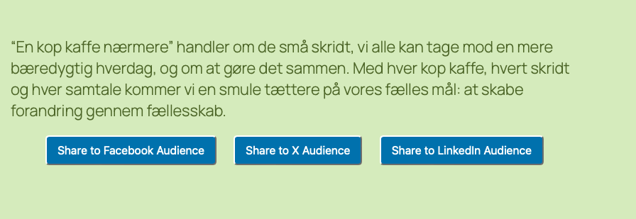

# Simple Social Sharing Plugin
**Author:** Marina Famme  
**Version:** 1.0  
**License:** GPL-2.0-or-later  
**Text Domain:** simple-social-sharing  
**Demo Website:** [design.hyggelicious.com](https://design.hyggelicious.com)

---

## 🌟 Description
**Simple Social Sharing** is a lightweight WordPress plugin that adds a clean, interactive sharing bar to any page or post.  
It lets visitors **copy and share a custom message** about the current post to their preferred social platforms (Facebook, X, and LinkedIn).

Each button:
1. Copies a platform-specific message (including the post title and URL) to the clipboard.  
2. Shows a confirmation alert.  
3. Turns into a “Go to [Platform]” button that opens the platform’s homepage.

This plugin was created as a learning project in Visual Studio Code and tested using [WordPress Playground](https://playground.wordpress.net/).

## 🖼️ Preview

---

## 🧩 Features
- Simple shortcode-based integration  
- Lightweight vanilla JavaScript (no jQuery dependency)  
- Copy-to-clipboard functionality  
- Dynamic button text change after copy  
- Clean, blue button styling via CSS  
- Works with any WordPress theme

---

## 🧰 Installation

1. **Download** or **clone** this repository.  
2. Compress the folder into a ZIP.  
3. In your WordPress dashboard, go to **Plugins → Add New → Upload Plugin**.  
4. Upload the ZIP file and click **Activate Plugin**.

---

## 💡 Usage

Add the shortcode below anywhere in your post or page content:
[sss_share_buttons]

It will display a centered row of three blue sharing buttons:
- Share to Facebook Audience  
- Share to X Audience  
- Share to LinkedIn Audience  

When a visitor clicks one, the message is copied to their clipboard and the button changes to a direct platform link.

---

## 🎨 Folder Structure

simple-social-sharing/
├── css/
│ └── myplugin-styles.css
├── js/
│ └── myplugin.js
├── myplugin.php (main plugin file)
└── README.md

---

## ⚙️ How It Works

**PHP (`myplugin.php`):**
- Enqueues CSS and JavaScript files.
- Defines the `[sss_share_buttons]` shortcode.
- Outputs the HTML for three platform buttons with custom `data-message` attributes containing post title and link.

**JavaScript (`myplugin.js`):**
- Waits for DOM to load.
- Adds click listeners to `.sss-button` elements.
- Copies each button’s message to the clipboard.
- Alerts the user and turns the button into a link to the selected platform.

**CSS (`myplugin-styles.css`):**
- Styles buttons with a blue background (`#0073aa`).
- Adds hover and rounded corner effects for a clean UI.

---

##  Tested In
- WordPress Playground (browser-based environment)  
- WordPress 6.x (Twenty Twenty-Four theme)  

---

##  Educational Purpose
This plugin demonstrates:
- Enqueuing assets in WordPress.
- Using shortcodes to embed dynamic content.
- Basic DOM manipulation and clipboard API in JavaScript.
- Simple WordPress plugin structure and documentation.

---

## 📜 License
This plugin is open source and distributed under the [GPL-2.0-or-later](https://www.gnu.org/licenses/gpl-2.0.html) license.

---

## 👩‍🎨 Author
**Marina Famme**  
[www.design.hyggelicious.com](https://design.hyggelicious.com)
the plugin is inspired by instuctions from linkedin learning course by Nyasha Green, called "Custom Wordpress Plugins:Design, Develop, Distribute" 

